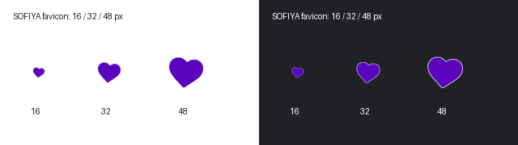
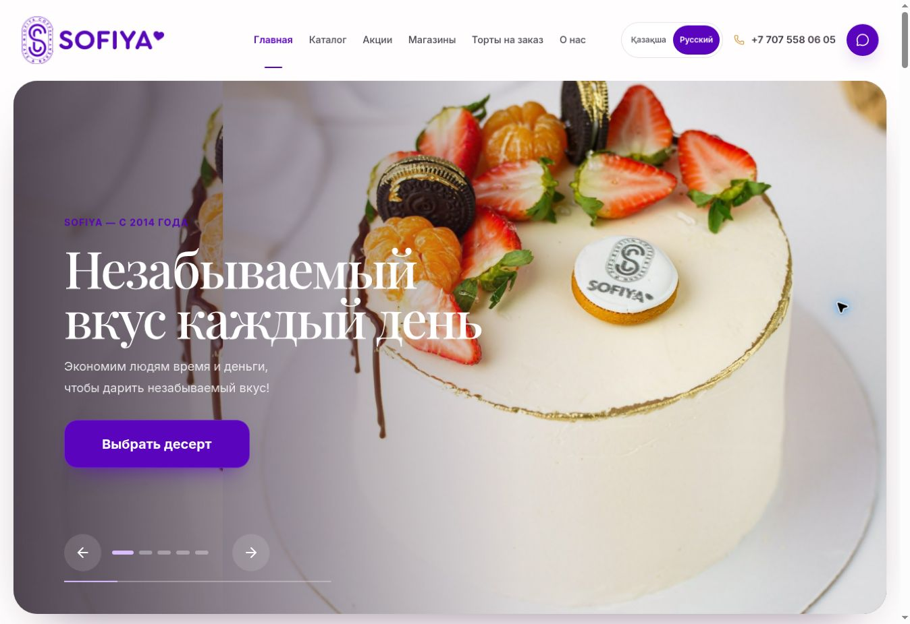
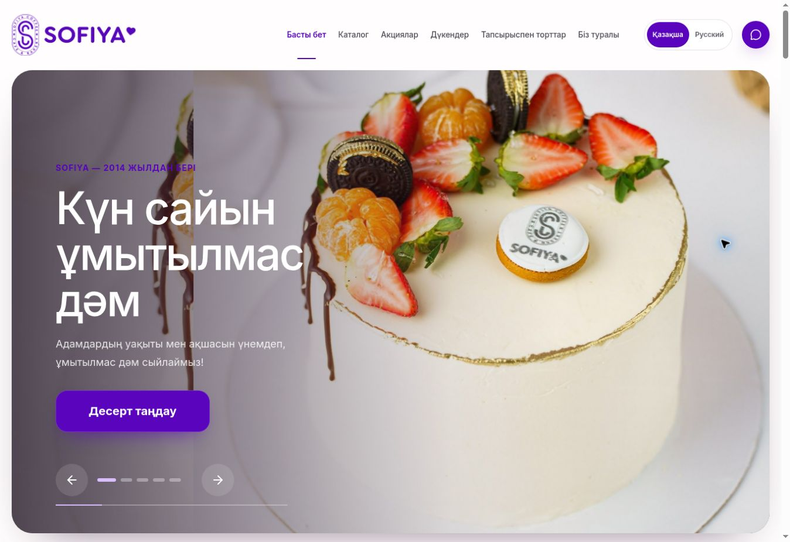

# SOFIYA — баннер и favicon, 11 сентября 2026

**Статус: локальный кандидат подготовлен; к визуальной приёмке пока не готов.**

Работа ограничена репозиторием `project100mln/sofiya-sweet-sweetness-hub` и сайтом
https://sofiyabakery.com. Production, main, домен, DNS и настройки хостинга не изменялись.
Push и PR не выполнялись.

## Исходное состояние

- Получен новый clone актуального репозитория. База `origin/main`:
  `95797652c06e8c1dc14e0a57498084f3c0342649`.
- Рабочая ветка: `agent/sofiya-hero-favicon-20260911`.
- Открытых PR на момент проверки нет. Старые локальные копии не использованы.
- Прочитаны `AGENTS.md`, checkpoint, очередь работ, инструкции выпуска,
  `.github/workflows/quality.yml`, `wrangler.jsonc` и конфигурация бренда.
  Старый checkpoint относится к предыдущему этапу; его статусы не приняты за текущие.
- Точный SHA развернутого production не опубликован в проверенном интерфейсе и не подтверждён.
  Текущие DOM, имена фотографий и логотипа совпадают с полученным исходником.
- Новый скриншот пользователя к сообщению не приложен. Дефект воспроизведён на самом
  production при viewport 1363 × 936 CSS px в RU и KK.

## Баннер — что установлено

В первом слайде одновременно отображаются две копии `cake-berry-hd.jpg`:
основная на весь баннер и декоративная справа шириной 76%. При завершённой анимации
основная имеет opacity 1 и единичный transform; дополнительная копия также полностью
непрозрачна. Её левый край находится на x ≈ 333.92 CSS px (при начале баннера x = 20).
Именно там виден вертикальный стык и повтор части торта. Дефект присутствует в обеих
локалях после полной загрузки и завершения анимации.

Исходная фотография осмотрена: такого вертикального разрыва в ней нет. Наложение двух
разных кадрирований подтверждено DOM, исходным кодом и скриншотами. Статус установления
причины: высокая уверенность. Ручные переходы 1 → 2 → 1 и автоматический 1 → 2 на
исходном production работают; это проверка исходника, не исправленного кандидата.

Изменения:

- Удалена дополнительная копия и ставший ненужным флаг `productFocus`.
- У первого кадра desktop object-position изменён с `56% 48%` на `56% 32%`, чтобы
  поднять область кадрирования к ягодам и маркировке. Это предварительное размещение;
  окончательная композиция требует браузерной проверки.
- Сам JPEG и HD-исходник 2560 × 3840 не изменены. Нового изображения нет.
- Общие стили, градиенты, таймер, анимация, остальные четыре слайда, тексты, кнопки и
  мобильное переопределение object-position не изменены.

**Статус баннера:** причина воспроизведена; код кандидата изменён; внешний вид после
изменения ещё не проверен. Нельзя утверждать, что итоговая композиция принята.

## Favicon — источник и реализация

Источник точной формы: `src/assets/sofiya-wordmark.png` — оригинальный wordmark из
репозитория, используемый как исходник фирменной надписи в существующем брендинге.
Действующий утверждённый логотип шапки `sofiya-logo-s-original.png` также осмотрен:
он содержит это сердечко. Для извлечения использован более крупный полный исходник,
а не уменьшенная и обрезанная по краям версия шапки. Основной логотип не изменён.

- Размер источника: 1800 × 320; область сердечка: x 1305…1439, y 50…174.
- SHA-256 источника и параметры извлечения: [favicon-source.json](favicon-source.json).
- SVG содержит 430 точек из контура альфа-канала на уровне 50%, с равномерным
  масштабированием и центрированием. Форма не нарисована по памяти и не заменена
  сторонней иконкой; исходного авторского вектора в проверенных ресурсах не найдено.
- `#5A04BD` подтверждён как наиболее частый непрозрачный цвет оригинального wordmark
  (70 263 пикселя) и базовый цвет оригинального логотипа шапки. Противоречия ориентиру
  нет. В уменьшенном сердечке шапки встречаются близкие оттенки после растровой
  обработки; глобальная палитра не изменялась.
- SVG: `public/favicon.svg`. ICO: `public/favicon.ico`, размеры 16, 32, 48.
- Для тёмной вкладки добавлена тонкая белая обводка позади фиолетовой заливки.
  Она не заменяет фирменный цвет. Форма центрирована в квадратном холсте.
- Старое подключение заменено двумя согласованными ссылками: ICO и SVG,
  обе с `?v=sofiya-heart-20260911`. Старый ICO-файл также заменён.
- Подключённых Apple Touch и manifest не обнаружено; новые не добавлялись.

Файловый образец, а не фактическая вкладка браузера:

**Статус favicon:** файлы подготовлены, размеры и HTTP-загрузка проверены; реальная
иконка вкладки ещё не проверена. Уверенность в источнике и файлах высокая, в поведении
кеша и отображении вкладки — пока не подтверждено.

## Выполненные проверки

| Проверка                                              | Результат                                                          |
| ----------------------------------------------------- | ------------------------------------------------------------------ |
| Чистая установка зависимостей существующего lockfile  | PASS; зависимости не добавлены                                     |
| Prettier, ESLint без предупреждений, TypeScript       | PASS                                                               |
| Unit-тесты                                            | 4 файла, 27 тестов PASS                                            |
| Реестр RU/KK                                          | 645 строк; все тексты, ID и статусы неизменны                      |
| Сборка Cloudflare                                     | PASS                                                               |
| Cloudflare Worker verifier                            | PASS: 140 локализованных маршрутов, assets и 404                   |
| Wrangler dry-run                                      | PASS; реального deploy не было                                     |
| Node build и bilingual SSR                            | PASS: 70 RU + 70 KK страниц, 420 sitemap alternates, SEO/404       |
| HTTP главных и прямых внутренних страниц              | PASS: `/`, `/kk`, `/catalog`, `/kk/catalog`                        |
| SVG/ICO по версионированным URL                       | PASS: HTTP 200, корректный Content-Type, байты совпадают с файлами |
| Главный SSR первого слайда                            | Одна фотография, заданное object-position                          |
| Secret scan и git diff --check                        | PASS                                                               |
| Скриншоты исправленного сайта 360/768/1440            | НЕ ВЫПОЛНЕНО                                                       |
| Визуальная проверка остальных слайдов после изменения | НЕ ВЫПОЛНЕНО                                                       |
| Исправленный CTA, языки и переходы в браузере         | НЕ ВЫПОЛНЕНО                                                       |
| Фактическая иконка вкладки / её кеш                   | НЕ ВЫПОЛНЕНО                                                       |
| Проектный browser-smoke / CI на ветке                 | НЕ ЗАПУСКАЛСЯ                                                      |

Первый `npm run check` остановился после 27 успешных тестов: реестр переводов содержал
старые номера строк изменённых компонентов. Штатный export обновил только 7 ссылок
на строки; отдельное сравнение подтвердило неизменность остальных полей всех 645
записей. Затем выполнена оставшаяся цепочка проверок. Полная цепочка одним повторным
запуском не дублировалась. Несвязанные старые ошибки не исправлялись.

HTTP-доказательства: [http-verification.json](http-verification.json).

## Сохранённые скриншоты до изменения

Обе фотографии сняты с production при 1363 × 936 CSS px после завершения анимации:

Скриншотов «после» и мобильных скриншотов пока нет. Образец favicon выше не заменяет
проверку страницы или вкладки браузера.

## Блокеры и безопасное продолжение

1. Доступный Cloud Browser отклоняет локальные URL (`ERR_BLOCKED_BY_CLIENT`), поэтому
   собрать страницу локально удалось, а осмотреть собранный кандидат через этот браузер — нет.
2. Панель https://dash.cloudflare.com после одной повторной загрузки остаётся на
   «Performing security verification / Verify you are human». Проверка не проходилась,
   настройки аккаунта не прочитаны. Требуется участие пользователя либо разрешение
   на прохождение CAPTCHA согласно навыку control-browser.
3. В репозитории workflow `Quality` содержит только проверки: pull_request и push main.
   Команды реальной production-публикации в нём нет. В `wrangler.jsonc` preview отделён
   от production. Однако внешние настройки Cloudflare Builds не проверены. Поэтому
   предписанная владельцем проверка безопасности push не завершена, push и PR отложены.
4. Существующая рабочая ссылка preview не подтверждена. Vercel не подключался и не использовался.

После доступа: проверить текущую production-ветку и триггеры внешних сборок; использовать
только уже существующий безопасный preview. Проверить RU/KK на 360, 768, 1440 и 1363 CSS px,
включая все слайды, автоматические/ручные переходы, языки, CTA, загрузку иконок и прямые
внутренние страницы. Сохранить сопоставимые «до/после», выполнить релевантный browser-smoke.
Только после подтверждения безопасности — push отдельной ветки и Draft PR без merge.

**Общий итог:** полезная техническая часть выполнена, но требования визуальной приёмки
ещё не закрыты. Production этой работой не изменялся.
